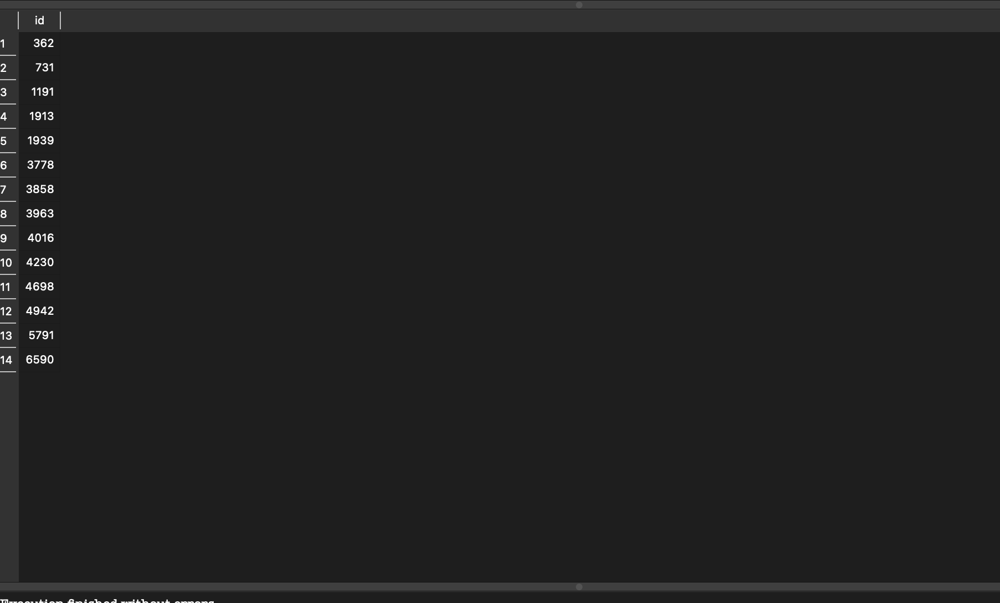
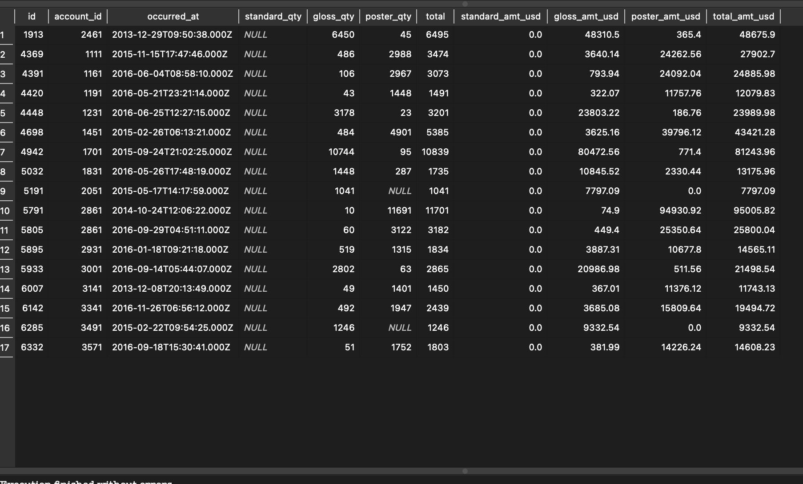
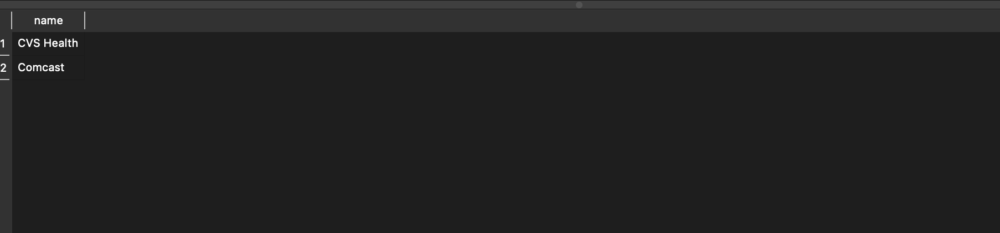
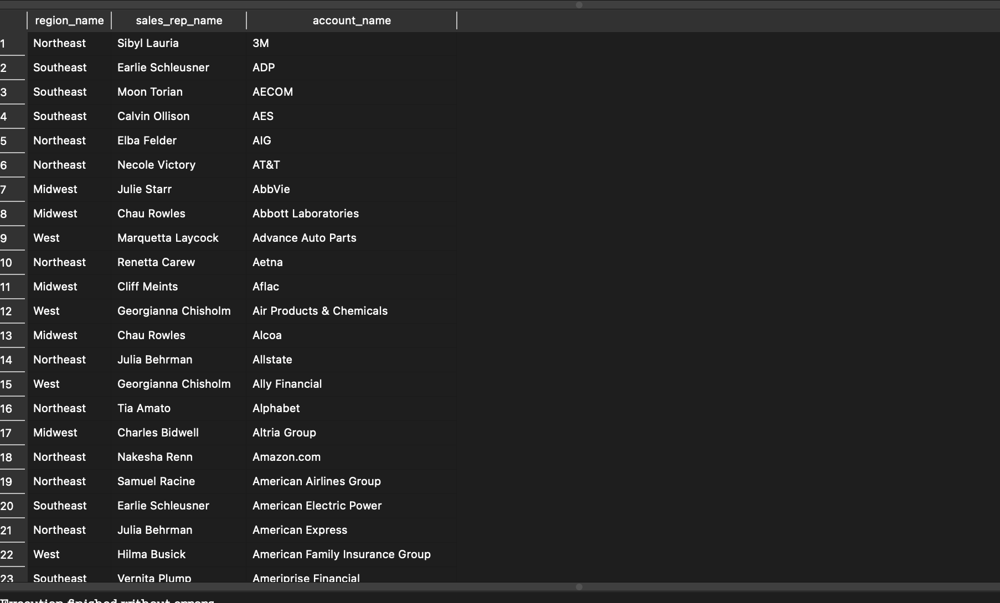

# CoreDataEngineers ETL and Analysis Project

This repository contains scripts and documentation for the ETL process and data analysis for CoreDataEngineers.


## Scripts

### ETL Script (etl_script.sh)

This Bash script performs a simple ETL process:
- Extracts data from a CSV file
- Transforms the data by renaming a column and selecting specific columns
- Loads the transformed data into a 'Gold' directory

### File Moving Script (move_files.sh)

This Bash script moves all CSV and JSON files from one directory to another.

### PostgreSQL Import Script (import_to_postgres.sh)

This script imports CSV files into a PostgreSQL database named 'posey'.

### SQL Analysis Queries (analysis_queries.sql)

This SQL script contains queries to answer specific business questions about the Parch and Posey data.

## ETL Pipeline Architecture


## Usage

1. Ensure you have the necessary permissions to execute the Bash scripts.
2. Update the scripts with the correct file paths and database credentials.
3. Run the scripts in the following order:
   - etl_script.sh
   - move_files.sh
   - import_to_postgres.sh
4. Use the SQL queries in analysis_queries.sql to analyze the imported data.

## Cron Job

The ETL script is scheduled to run daily at 12:00 AM using the following cron job:

```
0 0 * * * scripts/bash/etl_script.sh
```

## SQL Solutions

1. Find a list of order IDs where either `gloss_qty` or `poster_qty` is greater than 4000. Only include the `id` field in the resulting table.

```sql
SELECT id
FROM orders
WHERE gloss_qty > 4000 OR poster_qty > 4000;
```


2. Write a query that returns a list of orders where the `standard_qty` is zero and either the `gloss_qty` or `poster_qty` is over 1000.

```sql
SELECT *
FROM orders
WHERE standard_qty is null AND (gloss_qty > 1000 OR poster_qty > 1000);
```


3. Find all the company names that start with a 'C' or 'W', and where the primary contact contains 'ana' or 'Ana', but does not contain 'eana'.

```sql
SELECT name
FROM accounts
WHERE (name LIKE 'C%' OR name LIKE 'W%')
  AND (primary_poc LIKE '%ana%' OR primary_poc LIKE '%Ana%')
  AND primary_poc NOT LIKE '%eana%';
```


4. Provide a table that shows the region for each sales rep along with their associated accounts. Your final table should include three columns: the region name, the sales rep name, and the account name. Sort the accounts alphabetically (A-Z) by account name.

```sql
SELECT r.name AS region_name,
       s.name AS sales_rep_name,
       a.name AS account_name
FROM region r
JOIN sales_reps s ON r.id = s.region_id
JOIN accounts a ON s.id = a.sales_rep_id
ORDER BY a.name ASC;
```


